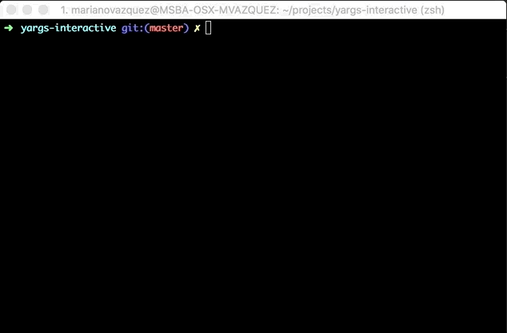
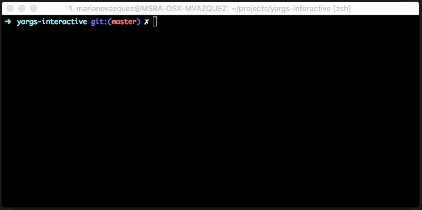

# Yargs Interactive
[](https://travis-ci.org/nanovazquez/yargs-interactive) [](https://coveralls.io/github/nanovazquez/yargs-interactive) [](https://github.com/semantic-release/semantic-release) [](https://www.npmjs.com/package/yargs-interactive)
[](https://www.npmjs.com/package/yargs-interactive)

[_Read the blog post_](https://medium.com/@nanovazquez/yargs-interactive-create-cli-tools-for-humans-and-non-humans-f9419f5cbd9e)

Interactive (prompt) support for [yargs](https://github.com/yargs/yargs), based on [inquirer](https://github.com/SBoudrias/Inquirer.js/). Useful for using the same CLI for both for humans and non-humans (like CI tools). Also supports mixed mode (yay!).


This tool helps you to build command line tools without worring to parse arguments, or develop the logic to ask them.

## Installation

```
npm install -S yargs-interactive
```

Then, add this code in your CLI code to get all the arguments parsed:

```js
#!/usr/bin/env node

const yargsInteractive = require('yargs-interactive');
const options = {
  name: { type: 'input', default: 'A robot', describe: 'Enter your name' },
  likesPizza: { type: 'confirm', default: false, describe: 'Do you like pizza?' },
};

yargsInteractive()
  .usage('$0 <command> [args]')
  .interactive(options)
  .then((result) => {
    // Your business logic goes here.
    // Get the arguments from the result
    // e.g. myCli(result.name);
      console.log(
        `\nResult is:\n`
        + `- Name: ${result.name}\n`
        + `- Likes pizza: ${result.likesPizza}\n`
      );
  });
```

Now, by simply wrapping your CLI code with this tool, you'll get all the information you need from the user. For instance, save the previous snipped in a file named *my-cli.js* and run it in your terminal:

```
➜ node my-cli.js --interactive
```



> **Note:** See other CLI examples [in this folder](./examples).

## Usage

It supports the following use cases
* [Prompt questions with default values (full-interactive)](#prompt-questions-with-default-values-full-interactive)
* [Prompt just some questions (mixed mode)](#prompt-just-some-questions-mixed-mode)
* [No prompt at all (ye olde yargs)](#no-prompt-at-all-ye-olde-yargs)

### Prompt questions with default values (full-interactive)

**my-cli.js**
```js
const yargsInteractive = require('yargs-interactive');

const options = {
  name: {
    type: 'input',
    default: 'nano',
    describe: 'Enter your name'
  },
  likesPizza: {
    type: 'confirm',
    default: false,
    describe: 'Do you like pizza?'
  },
};

yargsInteractive()
  .usage('$0 <command> [args]')
  .interactive(options)
  .then((result) => {
    // The tool will prompt questions and will output your answers.
    // TODO: Do something with the result (e.g result.name)
    console.log(result)
  });
```

**Usage in terminal**

```
➜ node my-cli.js --interactive
```



If you want to **use interactive mode always**, avoiding the need of sending it as an argument, set the `--interactive` parameter to `true` by default:

```js
const options = {
  interactive: { default: true },
  ...
};

yargsInteractive()
  .usage('$0 <command> [args]')
  .interactive(options)
  .then((result) => {
    // The tool will prompt questions and will output your answers.
    // TODO: Do something with the result (e.g result.name)
    console.log(result)
  });
```

And then simply call your CLI with no parameters.

```
➜ node my-cli.js
```

### Options

| Property   | Type         | Description                   |
| ---------- | -------------| ----------------------------- |
| type       |  string      | _(Required)_ The type of the option to prompt (e.g. `input`, `confirm`, etc.). **We provide all prompt types supported by [Inquirer](https://github.com/SBoudrias/Inquirer.js/#prompt-types).**|
| describe   |  string      | _(Required)_ The message to display when prompting the option (e.g. `Do you like pizza?`) |
| default    |  any         | The default value of the option. |
| prompt     |  string      | _(Default is `if-empty`)_ Property to decide whether to prompt the option or not. Possible values: `always`, `never` and `if-empty`, which prompts the option if the value wasn't set via command line parameters or using the default property. |

### Prompt just some questions (mixed mode)

You can opt-out options from interactive mode by setting the `prompt` property to `never`.

**my-cli.js**
```js
const yargsInteractive = require('yargs-interactive');

const options = {
  name: {
    type: 'input',
    name: 'nano',
    describe: 'Enter your name'
  },
  likesPizza: {
    type: 'confirm',
    default: false,
    describe: 'Do you like pizza?',
    prompt: 'never' // because everyone likes pizza
  },
};

yargsInteractive()
  .usage('$0 <command> [args]')
  .interactive(options)
  .then((result) => {
    // The tool will prompt questions output the answers.
    // You can opt-out options by using `prompt: 'never'`. For these properties, it
    // will use the value sent by parameter (--likesPizza) or the default value.
    // TODO: Do something with the result (e.g result.name)
    console.log(result);
  });
```

 By default, its value is `if-empty`, prompting the question to the user if the value was not set via command line parameters or using the default property. Last, you can use `always` to always prompt the option.

**Usage in terminal**
```
➜ node my-cli.js --name='Johh' --interactive
```

### No prompt at all (ye olde yargs)

**my-cli.js**
```js
const yargsInteractive = require('yargs-interactive');

const options = {
  name: {
    type: 'input',
    name: 'nano',
    describe: 'Enter your name'
  },
  likesPizza: {
    type: 'confirm',
    default: false,
    describe: 'Do you like pizza?'
  },
};

yargsInteractive()
  .usage('$0 <command> [args]')
  .interactive(options)
  .then((result) => {
    // The tool will output the values set via parameters or
    // the default value (if not provided).
    // TODO: Do something with the result (e.g result.name)
    console.log(result);
  });
```

**Usage in terminal**
```
➜ node my-cli.js --name='Johh' --likesPizza
```
